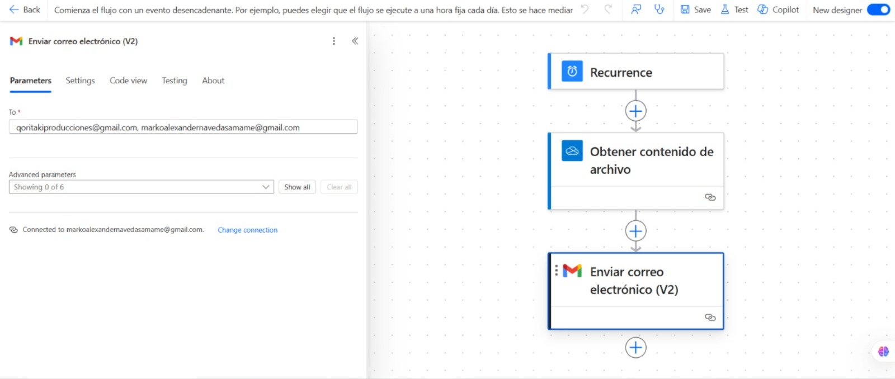
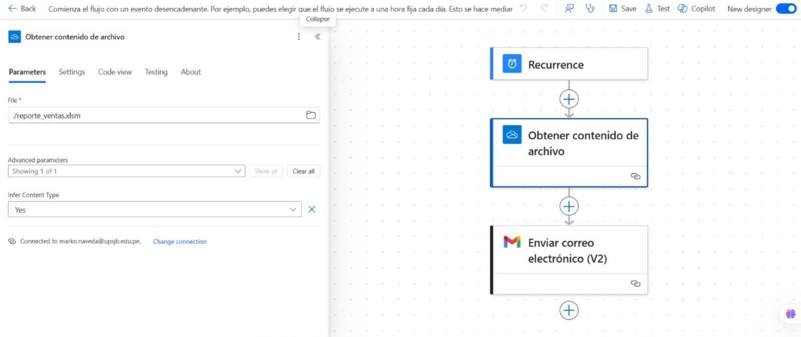
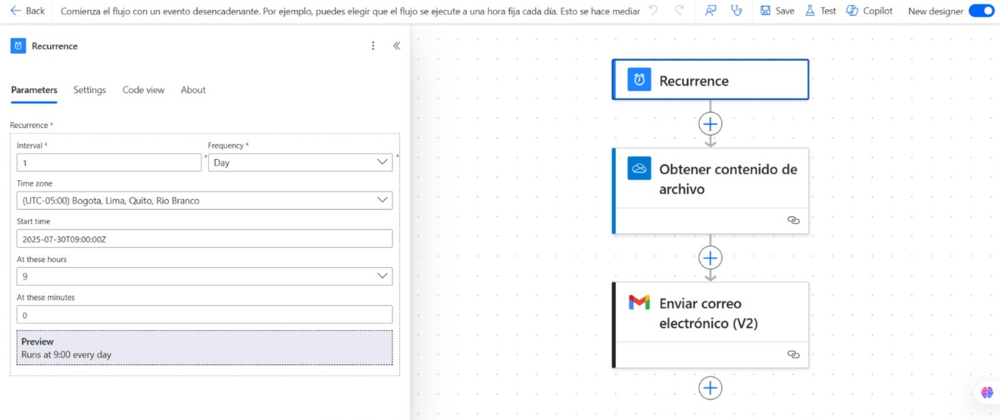

# Proyecto: Automación de Envío de Correos con Power Automate

## Descripción
Este flujo automatiza el proceso de enviar correos electrónicos diarios con un archivo Excel adjunto que contiene el reporte de ventas del día. El flujo se ejecuta a las 9:00 AM todos los días y envía el correo a una lista de destinatarios predefinidos.

## Pasos para Ejecutar el Flujo:
1. Crea un flujo de trabajo en Power Automate con el trigger de "Recurrencia" a las 9:00 AM todos los días.
2. Configura una acción para obtener el archivo de Excel desde OneDrive o SharePoint.
3. Añade una acción para enviar un correo electrónico con el archivo adjunto.
4. Personaliza la lista de destinatarios y el mensaje.

## Capturas de Pantalla

### Flujo de Envío de Correo

### Obtener Contenido del Archivo Excel

### Trigger de Recurrencia

## Requisitos:
- Power Automate
- OneDrive o SharePoint para almacenar el archivo Excel
- Lista de destinatarios
